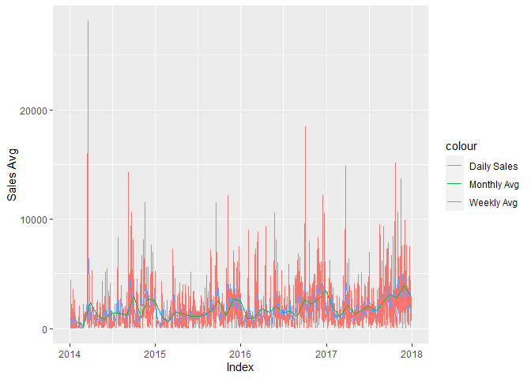
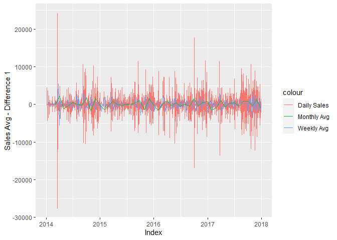
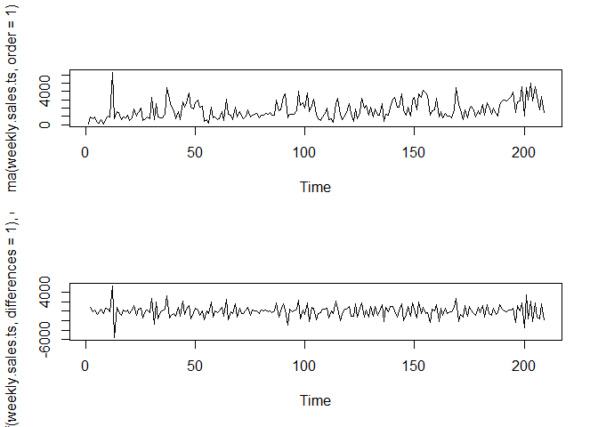
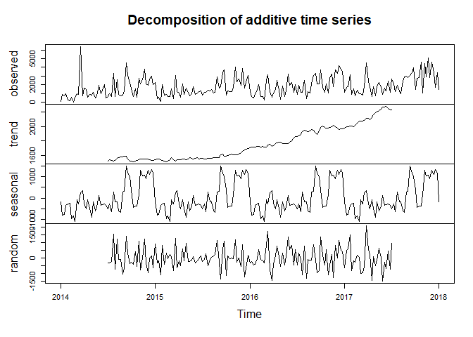
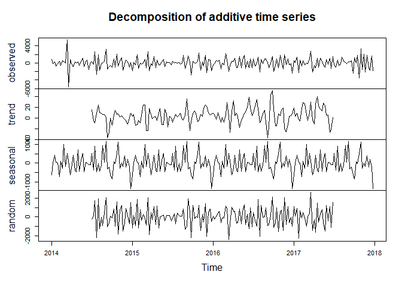
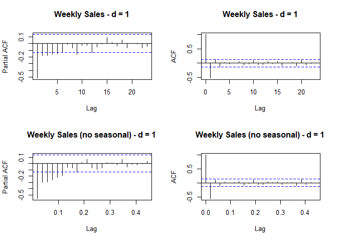
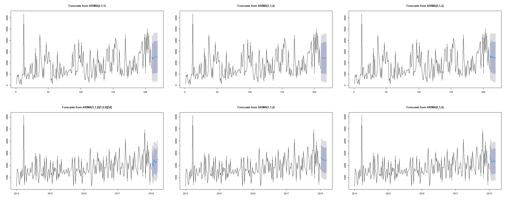

TimeSeries Forecasting - ARIMA
================

#### 1. Loading of libraries

``` r
if(!require(lubridate)) install.packages('lubridate'); library("lubridate"); ## date functions
if(!require(xts)) install.packages('xts'); library("xts"); ## time series
if(!require(tseries)) install.packages('tseries'); library("tseries"); ## time series
if(!require(ggplot2)) install.packages('ggplot2'); library("ggplot2"); ## plot
if(!require(forecast)) install.packages('forecast'); library("forecast"); ## forecast
```

<br><br> \#### 2. Reading the data

``` r
set.seed(1)
# setting the current working directory
##setwd('')

# Reading the csv file
data <- read.csv('superstores.csv')
```

<br><br> \#### 3. Data Pre-processing

``` r
# checking the column names and removing the unwanted columns
# converting the Order.Date column to date format
colnames(data)
```

    ##  [1] "Row.ID"        "Order.ID"      "Order.Date"    "Ship.Date"    
    ##  [5] "Ship.Mode"     "Customer.ID"   "Customer.Name" "Segment"      
    ##  [9] "Country"       "City"          "State"         "Postal.Code"  
    ## [13] "Region"        "Product.ID"    "Category"      "Sub.Category" 
    ## [17] "Product.Name"  "Sales"         "Quantity"      "Discount"     
    ## [21] "Profit"

``` r
data <- subset(data, select = -c(Row.ID))
data$Order.Date <- mdy(data$Order.Date)
data$Order.Date[is.na(data$Order.Date)] <-as.Date(data$Order.Date , format = "%m/%d/%Y")

# To check if there are any NA values in Order.Date after conversion
sum(is.na(data$Order.Date))
```

    ## [1] 0

``` r
#Formatting columns
data$Ship.Date <- mdy(data$Ship.Date)
data$Ship.Date[is.na(data$Ship.Date)] <-as.Date(data$Ship.Date , format = "%m/%d/%Y")
data$Sales <- as.numeric(data$Sales)
data$Quantity <- as.numeric(data$Quantity)
data$Discount <- as.numeric(data$Discount)
data$Profit <- as.numeric(data$Profit)

#Removing unncessary columns
data <- subset(data, select = c(Order.Date,Sales,Quantity,Discount,Profit))

#Aggregating the sales, quantity, discount and profit for each day based on Order.Date
data <- aggregate(data[,2:5], by = list(data$Order.Date), FUN = sum)
colnames(data)[1] <- "Order.Date"

#Converting dataframe to timeseries 
data <- data [order(data$Order.Date),]
data.ts <- xts(subset(data, select = -c(Order.Date)), order.by = data$Order.Date)

#Checking if there are any NA values in any columns in the dataset
colSums(is.na(data.ts))
```

    ##    Sales Quantity Discount   Profit 
    ##        0        0        0        0

``` r
#Summary
summary(data.ts)
```

    ##      Index                Sales              Quantity         Discount    
    ##  Min.   :2014-01-03   Min.   :    2.025   Min.   :  1.00   Min.   :0.000  
    ##  1st Qu.:2015-01-06   1st Qu.:  377.736   1st Qu.: 11.00   1st Qu.:0.200  
    ##  Median :2016-02-03   Median : 1063.185   Median : 24.00   Median :0.900  
    ##  Mean   :2016-01-20   Mean   : 1857.074   Mean   : 30.62   Mean   :1.262  
    ##  3rd Qu.:2017-01-19   3rd Qu.: 2395.786   3rd Qu.: 44.00   3rd Qu.:1.900  
    ##  Max.   :2017-12-30   Max.   :28106.716   Max.   :152.00   Max.   :8.000  
    ##      Profit         
    ##  Min.   :-6247.397  
    ##  1st Qu.:    7.654  
    ##  Median :   96.668  
    ##  Mean   :  231.525  
    ##  3rd Qu.:  314.902  
    ##  Max.   : 8738.797

``` r
#Order dates range from 2014-01-03 to 2017-12-30
```

<br><br> \#### 4. Exploratory Data Analysis

``` r
## Daily, Weekly and Monthly sales.
daily.sales.ts <- subset(data.ts,select = c(Sales))
weekly.sales.ts <- apply.weekly(daily.sales.ts,mean)
monthly.sales.ts <- apply.monthly(daily.sales.ts,mean)

## Plotting Sales Avg of daily, weekly and monthly 
ggplot()+
  geom_line(data=daily.sales.ts, aes(x=Index, y=Sales, colour="Daily Sales"))+
  geom_line(data=weekly.sales.ts,aes(x=Index, y= Sales, colour="Weekly Avg"))+
  geom_line(data=monthly.sales.ts, aes(x=Index, y=Sales, colour="Monthly Avg"))+
  ylab("Sales Avg")
```

<!-- -->

``` r
## Plotting Sales Avg of daily, weekly and monthly with differences = 1
ggplot()+
  geom_line(data=diff(daily.sales.ts,differences = 1), aes(x=Index, y=Sales, colour="Daily Sales"))+
  geom_line(data=diff(weekly.sales.ts,differences = 1),aes(x=Index, y= Sales, colour="Weekly Avg"))+
  geom_line(data=diff(monthly.sales.ts,differences = 1), aes(x=Index, y=Sales, colour="Monthly Avg"))+
  ylab("Sales Avg - Difference 1")
```

<!-- -->

##### Weekly average has less variance when compared to the daily sales. Hence we consider weekly average for further analysis

##### Though Monthly average also has less variance, there is a chance of missing the accuracy of the data if we smooth too much.

<br><br>

``` r
## Plotting moving averages of weekly sales with/without differences = 1
par(mfrow=c(2,1))
plot(ma(weekly.sales.ts, order = 1))
plot(ma(diff(weekly.sales.ts,differences = 1), order = 1))
```

<!-- -->

``` r
par(mfrow=c(1,1))
```

##### As the plot with differences = 1, seems to have a constant mean (average) than without considering difference,

##### we shall consider the differences = 1 for building and testing the model

<br><br> \#### 5. Test for stationarity

``` r
## Creating a difference variable for the weekly
weekly.sales.ts.diff1 <- diff(weekly.sales.ts, differences = 1)

##removing the first record where difference is NA
weekly.sales.ts.diff1 <- weekly.sales.ts.diff1[!is.na(weekly.sales.ts.diff1)] 

adf.test(weekly.sales.ts.diff1, alternative="stationary") 
```

    ## 
    ##  Augmented Dickey-Fuller Test
    ## 
    ## data:  weekly.sales.ts.diff1
    ## Dickey-Fuller = -9.4043, Lag order = 5, p-value = 0.01
    ## alternative hypothesis: stationary

##### As p-value = 0.01 \< 0.05, we can reject the null hypothesis that the weekly.sales.ts.diff1 is not-stationary with \>95% confidence i.e., we can consider weekly.sales.ts.diff1 as stationary. \[Lag order = 5\]

<br><br>

``` r
## Checking if there is any seasonality and to determine inclusion/non-inclusion of seasonality improves the accuracy of the model

## Decomposition of Data

weekly.sales.decomp <- ts(weekly.sales.ts,frequency=52,start=c(2014,1))
weekly.sales.decomp <- decompose(weekly.sales.decomp)

weekly.sales.diff1.decomp <- ts(weekly.sales.ts.diff1,frequency=52,start=c(2014,1))
weekly.sales.diff1.decomp <- decompose(weekly.sales.diff1.decomp)

plot(weekly.sales.decomp)
```

<!-- -->

``` r
plot(weekly.sales.diff1.decomp)
```

<!-- -->

``` r
weekly.sales.ts.seasonAdj <- ts(weekly.sales.ts,frequency=52,start=c(2014,1)) - weekly.sales.decomp$seasonal
weekly.sales.ts.diff1.seasonAdj <- ts(weekly.sales.ts.diff1,frequency=52,start=c(2014,1)) - weekly.sales.diff1.decomp$seasonal

adf.test(weekly.sales.ts.seasonAdj, alternative="stationary") ## stationary Lag Order = 5
```

    ## 
    ##  Augmented Dickey-Fuller Test
    ## 
    ## data:  weekly.sales.ts.seasonAdj
    ## Dickey-Fuller = -6.1609, Lag order = 5, p-value = 0.01
    ## alternative hypothesis: stationary

``` r
adf.test(weekly.sales.ts.diff1.seasonAdj, alternative="stationary") ## stationary Lag Order = 5
```

    ## 
    ##  Augmented Dickey-Fuller Test
    ## 
    ## data:  weekly.sales.ts.diff1.seasonAdj
    ## Dickey-Fuller = -11.213, Lag order = 5, p-value = 0.01
    ## alternative hypothesis: stationary

<br><br> \#### 6. Finding p,d,q values for ARIMA models

``` r
## p - AR (identified by PACF), d - difference, q - MA (identified by ACF)
par(mfrow=c(2,2))
pacf(weekly.sales.ts.diff1, main = "Weekly Sales - d = 1")
acf(weekly.sales.ts.diff1, main = "Weekly Sales - d = 1")

pacf(weekly.sales.ts.diff1.seasonAdj, main = "Weekly Sales (no seasonal) - d = 1")
acf(weekly.sales.ts.diff1.seasonAdj, main = "Weekly Sales (no seasonal) - d = 1")
```

<!-- -->

``` r
par(mfrow=c(1,1))
```

##### “Weekly Sales - d = 1” –\> p = 1 (considering only very significant) or 6 (all crossing the boundaries) , d = 1, q = 2

##### “Weekly Sales (no seasonal) - d = 1” –\> p = 6 , d = 1, q = 2

<br><br> \#### 7. Building models

``` r
# Ljung-Box : p-value > 0.05 - No correlation exists between residuals, better model 
# Lower AIC : Better model
# Lower RMSE : Better model
# Lower p, d, q : Better model based on 


## Function to store the final results in a dataframe for presentation
column.names <- c("series.name","fit.model","aic","rmse","Ljung-Box.p")
final.results.df <- data.frame(matrix(ncol=5,nrow=0))
colnames(final.results.df) <- column.names

concatenate.final.results.func <- function(series.name,fit.model.name,aic,rmse,ljung.box.p.value){
  temp.results.df <- data.frame(series.name,fit.model.name,aic,rmse,ljung.box.p.value)
  colnames(temp.results.df) <- column.names
  final.results.df <- rbind(final.results.df,temp.results.df)
  return(final.results.df)
}

## without seasonal adjustment. i.e., weekly.sales.ts

## Auto ARIMA model without seasonal adjustment
fit.weekly.sales.auto <- auto.arima(weekly.sales.ts)
fcast.weekly.sales.auto <- forecast(fit.weekly.sales.auto, h=10)
# summary(fcast.weekly.sales.auto)
## ORDER (2,1,1) : AIC = 3478.3, RMSE = 1008.765
# Box.test(fit.weekly.sales.auto$residuals, lag = 20, type = "Ljung-Box") # p = 0.8931

final.results.df <- concatenate.final.results.func(fit.weekly.sales.auto$series,
                                                   as.character(fit.weekly.sales.auto),
                                                   fit.weekly.sales.auto$aic,
                                                   accuracy(fcast.weekly.sales.auto)[2],
                                                   Box.test(fit.weekly.sales.auto$residuals, lag = 20, type = "Ljung-Box")$p.value)

##  ARIMA model ORDER = 1,1,2 without seasonal adjustment
fit.weekly.sales.112 <- arima(weekly.sales.ts, order = c(1,1,2))
fcast.weekly.sales.112 <- forecast(fit.weekly.sales.112, h=10)
#summary(fcast.weekly.sales.112)
## ORDER (1,1,2) : AIC = 3481.3, RMSE = 1016.1
# Box.test(fit.weekly.sales.112$residuals, lag = 20, type = "Ljung-Box")  # p = 0.7407

final.results.df <- concatenate.final.results.func(fit.weekly.sales.112$series,
                                                   as.character(fit.weekly.sales.112),
                                                   fit.weekly.sales.112$aic,
                                                   accuracy(fcast.weekly.sales.112)[2],
                                                   Box.test(fit.weekly.sales.112$residuals, lag = 20, type = "Ljung-Box")$p.value)

##  ARIMA model ORDER = 6,1,2 without seasonal adjustment
fit.weekly.sales.612 <- arima(weekly.sales.ts, order = c(6,1,2))
fcast.weekly.sales.612 <- forecast(fit.weekly.sales.612, h=10)
#summary(fcast.weekly.sales.612)
## ORDER (6,1,2) : AIC = 3487.07, RMSE = 1005.8
#Box.test(fit.weekly.sales.612$residuals, lag = 20, type = "Ljung-Box") # p = 0.8719
final.results.df <- concatenate.final.results.func(fit.weekly.sales.612$series,
                                                   as.character(fit.weekly.sales.612),
                                                   fit.weekly.sales.612$aic,
                                                   accuracy(fcast.weekly.sales.612)[2],
                                                   Box.test(fit.weekly.sales.612$residuals, lag = 20, type = "Ljung-Box")$p.value)


## without seasonal adjustment. i.e., weekly.sales.ts.seasonalAdj

# Auto ARIMA model with seasonal adjustment
fit.weekly.sales.seaAdj.auto <- auto.arima(weekly.sales.ts.seasonAdj)
fcast.weekly.sales.seaAdj.auto <- forecast(fit.weekly.sales.seaAdj.auto, h=10)
#summary(fcast.weekly.sales.seaAdj.auto)
## ORDER (1,1,2) : AIC = 3379.69, RMSE = 784.2702
#Box.test(fit.weekly.sales.seaAdj.auto$residuals, lag = 20, type = "Ljung-Box") # p = 0.3049
final.results.df <- concatenate.final.results.func(fit.weekly.sales.seaAdj.auto$series,
                                                   as.character(fit.weekly.sales.seaAdj.auto),
                                                   fit.weekly.sales.seaAdj.auto$aic,
                                                   accuracy(fcast.weekly.sales.seaAdj.auto)[2],
                                                   Box.test(fit.weekly.sales.seaAdj.auto$residuals, lag = 20, type = "Ljung-Box")$p.value)

## No correlation then better model, the p > 0.05

##  ARIMA model ORDER = 1,1,2 with seasonal adjustment
fit.weekly.sales.seaAdj.112 <- arima(weekly.sales.ts.seasonAdj, order = c(1,1,2))
fcast.weekly.sales.seaAdj.112 <- forecast(fit.weekly.sales.seaAdj.112, h=10)
#summary(fcast.weekly.sales.seaAdj.112)
## ORDER (1,1,2) : AIC = 3381.72, RMSE = 797.4484
#Box.test(fit.weekly.sales.seaAdj.112$residuals, lag = 20, type = "Ljung-Box") # p = 0.833
final.results.df <- concatenate.final.results.func(fit.weekly.sales.seaAdj.112$series,
                                                   as.character(fit.weekly.sales.seaAdj.112),
                                                   fit.weekly.sales.seaAdj.112$aic,
                                                   accuracy(fcast.weekly.sales.seaAdj.112)[2],
                                                   Box.test(fit.weekly.sales.seaAdj.112$residuals, lag = 20, type = "Ljung-Box")$p.value)

##  ARIMA model ORDER = 6,1,2 with seasonal adjustment
fit.weekly.sales.seaAdj.612 <- arima(weekly.sales.ts.seasonAdj, order = c(6,1,2))
fcast.weekly.sales.seaAdj.612 <- forecast(fit.weekly.sales.seaAdj.612, h=10)
#summary(fcast.weekly.sales.seaAdj.612)
## ORDER (6,1,2) : AIC = 3389.62, RMSE = 793.6791
#Box.test(fit.weekly.sales.seaAdj.612$residuals, lag = 20, type = "Ljung-Box") # p = 0.9042
final.results.df <- concatenate.final.results.func(fit.weekly.sales.seaAdj.612$series,
                                                   as.character(fit.weekly.sales.seaAdj.612),
                                                   fit.weekly.sales.seaAdj.612$aic,
                                                   accuracy(fcast.weekly.sales.seaAdj.612)[2],
                                                   Box.test(fit.weekly.sales.seaAdj.612$residuals, lag = 20, type = "Ljung-Box")$p.value)
```

<br><br>

``` r
par(mfrow=c(2,3))
plot(fcast.weekly.sales.auto)
plot(fcast.weekly.sales.112)
plot(fcast.weekly.sales.612)
plot(fcast.weekly.sales.seaAdj.auto)
plot(fcast.weekly.sales.seaAdj.112)
plot(fcast.weekly.sales.seaAdj.612)
```

<!-- -->

``` r
par(mfrow=c(1,1))
```

<br><br>

``` r
## Comparision of models.
print(final.results.df)
```

    ##                 series.name               fit.model      aic      rmse
    ## 1           weekly.sales.ts            ARIMA(2,1,1) 3478.296 1008.7651
    ## 2           weekly.sales.ts            ARIMA(1,1,2) 3481.301 1016.1002
    ## 3           weekly.sales.ts            ARIMA(6,1,2) 3487.072 1005.8110
    ## 4 weekly.sales.ts.seasonAdj ARIMA(1,1,2)(1,0,0)[52] 3379.686  784.2702
    ## 5 weekly.sales.ts.seasonAdj            ARIMA(1,1,2) 3381.715  797.4484
    ## 6 weekly.sales.ts.seasonAdj            ARIMA(6,1,2) 3389.619  793.6791
    ##   Ljung-Box.p
    ## 1   0.8931259
    ## 2   0.7406729
    ## 3   0.8718947
    ## 4   0.3048979
    ## 5   0.8330085
    ## 6   0.9042450

<br><br> \#### Conclusion: Based on AIC, RMSE, p, d and q values, Auto
Arima Model (1,1,2) with seasonal adjustment gives better forecast
values
